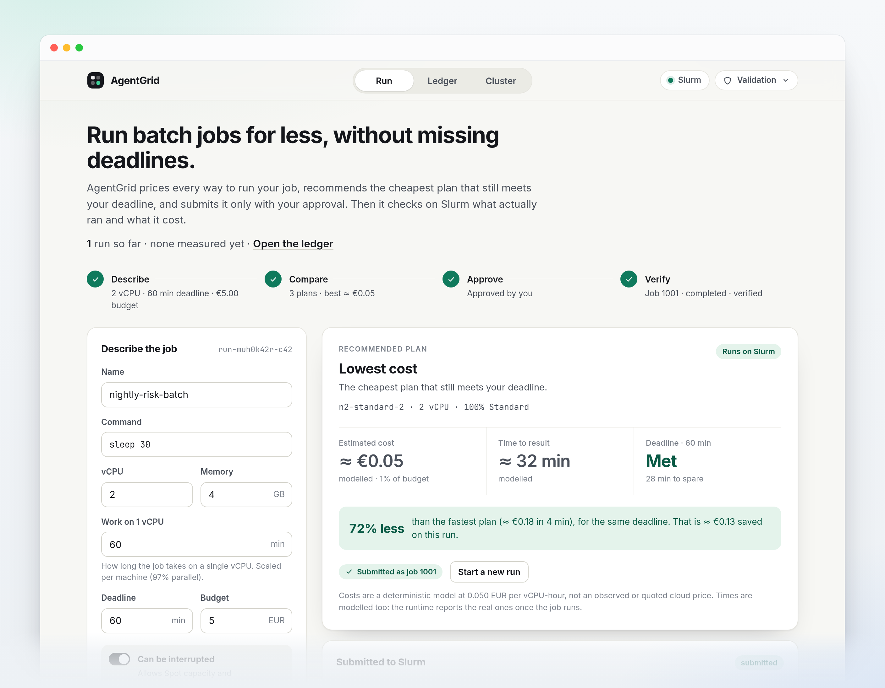
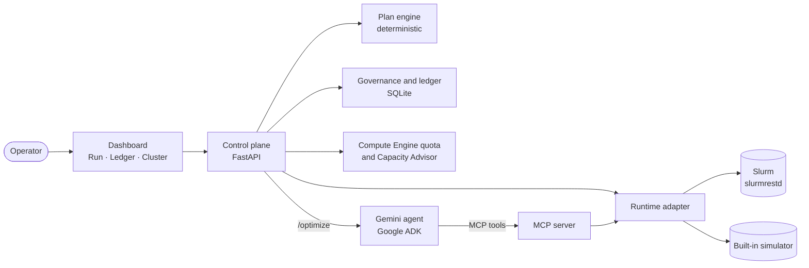
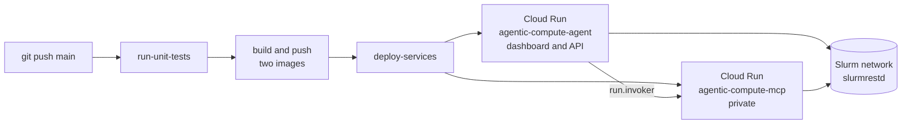

<div align="center">

# AgentGrid

**Run batch jobs for less, without missing deadlines.**

AgentGrid prices every way to run a batch job, recommends the cheapest plan that still meets your deadline,
submits it to Slurm only with your approval, then checks on the controller what actually ran.

[](https://antigravity.google)
[](LICENSE)
[](https://www.python.org/)
[](https://cloud.google.com/)

<br>



<sub>The Run tab after a run: three plans compared, the cheapest one that meets the deadline approved, then submitted and verified on Slurm.<br>
Captured locally against a mock <code>slurmrestd</code>. Costs and times are modelled, as the page says.</sub>

</div>

---

## Why AgentGrid

Batch jobs are usually sized by habit ("60 cores, to be safe"). The constraints that matter, a deadline and a
budget, are not something Slurm or the cloud console reasons about. AgentGrid does the arithmetic before the run
and checks the facts after it.

- **Cheaper, by construction.** Every executable machine shape is priced against your deadline. The
  recommendation is the cheapest plan that still meets it, and the page says how much less it costs than the
  fastest plan for the same deadline.
- **Nothing runs without you.** Plans are proposals. In the default mode a job is submitted only after you
  approve that exact plan, and a double click or a retried request never starts a second job.
- **Checked, not assumed.** A job counts as running only when the Slurm controller reports an allocation for
  it. Modelled numbers are labelled as modelled and never shown as measured.

## How it works

The dashboard follows the four steps of a run.

| Step | What AgentGrid does |
| :--- | :--- |
| **1. Describe** | You give the command, the vCPU and memory, how long the work takes on one vCPU, the deadline, the budget, and whether the job can be interrupted. |
| **2. Compare** | A deterministic engine scales the work to each machine shape (Amdahl's law, 97% parallel for a parallel job), prices it, drops the shapes that miss the deadline or the budget, and checks the rest against your Compute Engine quota. You get up to three plans: *Lowest cost*, *Fastest* and *Balanced*. When nothing fits, you get what blocks and what to relax, never an invented winner. |
| **3. Approve** | You approve one plan. The approval is bound to the plan's content: change the plan and the approval no longer applies. |
| **4. Verify** | AgentGrid submits the job through `slurmrestd` and follows it on the controller: pending, running on the allocated CPUs, completed. The **Cluster** tab shows the live controller state, the capacity that could take the next job, and why a job may be waiting. |

On Slurm, the machine shapes are your partitions (see [Connect your Slurm cluster](#connect-your-slurm-cluster)).



## What makes it trustworthy

- **Arithmetic is code.** Plans, quota checks, ceilings and verification are deterministic Python. The Gemini
  agent is optional (`/optimize`) and acts only through typed MCP tools that enforce the same rules.
- **Three kinds of numbers, never mixed.** *Measured* (read from the runtime), *modelled* (the plan engine:
  0.050 EUR per vCPU-hour by default, not a cloud price) and *declared* (a figure someone typed). The dashboard
  and the API label each one.
- **Governance held by the server.** *Advisory* never changes anything, *Validation* (the default) needs your
  approval for each plan, *Delegation* runs within a budget, machine types, regions and a retry count. A caller
  can tighten the mode, never loosen it.
- **Exactly-once submission.** A submission is claimed in SQLite, keyed by workload and plan fingerprint,
  before the runtime is touched. A double click, a replayed request or a restart resolve to the same job.
- **Ceilings that add up.** The delegated budget and the retry count are rebuilt from the submission ledger
  inside the same transaction as the claim, so concurrent requests cannot slip past them.
- **Constraints bind execution.** Regions, zones, Spot and fallback rules declared on the workload are checked
  at submission and on every fallback rung, not only when planning.

How each guarantee is enforced, and the test that pins it: [docs/guarantees.md](docs/guarantees.md).

## Status

| Area | Status |
| :--- | :--- |
| Plans, governance, exactly-once submission, ceilings, constraints | Covered by the test suite (379 tests) |
| Compute Engine quota read | Exercised against the live API |
| Slurm adapter | Tested against a mock `slurmrestd`, in unit tests and in a real browser. Live re-run on the reference cluster: pending |
| Dashboard | Compiled and rendered offline by the test suite, driven in headless Chrome during development |
| Measured cost and duration in the Ledger | Not written back yet: after a verified run, the Ledger still says "none measured yet" |
| History on Cloud Run | SQLite inside the container, lost when the instance is replaced |
| Multi-tenant authentication | Out of scope. An optional shared API key protects the API |

## Quick start

No cloud account needed: without configuration, runs go to the built-in simulator, and the page says so.

```bash
git clone https://github.com/samy-fadel/agentgrid.git
cd agentgrid
python3 -m venv .venv && source .venv/bin/activate
pip install -e ".[dev]"

AGENTGRID_PLAN_CAPACITY_CHECK=false PORT=8080 python3 -m compute_agent.app
```

`AGENTGRID_PLAN_CAPACITY_CHECK=false` skips the Compute Engine quota lookup, which needs Google Cloud credentials
(without them, every comparison waits on the credential search). Plans then say `NOT_CHECKED`. With credentials,
drop it and set `GOOGLE_CLOUD_PROJECT`.

Open <http://localhost:8080/>, or call the API directly:

```bash
curl -s localhost:8080/health
curl -s -X POST localhost:8080/api/plans/compare -H 'Content-Type: application/json' \
  -d '{"workload_profile": {"workload_id": "wl-demo", "cpu_requested": 8, "memory_mb_requested": 16384,
       "estimated_duration_minutes": 60, "deadline_minutes_from_start": 60, "budget_amount": 50}}'
```

An unknown key in `workload_profile` is rejected with HTTP 400 naming the field, so a typo cannot silently drop
a constraint.

### Optional: the Gemini agent

```bash
gcloud auth application-default login
cp .env.example .env    # set GOOGLE_CLOUD_PROJECT, GOOGLE_CLOUD_LOCATION, AGENTIC_COMPUTE_MODEL
adk web .               # playground on http://localhost:8000, pick compute_agent
```

The control plane serves the same agent on `POST /optimize` and `POST /optimize/stream` (Server-Sent Events).

## Connect your Slurm cluster

AgentGrid talks to Slurm through `slurmrestd` (data parser v0.0.41), authenticated with a JWT.

```bash
COMPUTE_RUNTIME=slurm \
SLURM_REST_URL=http://<controller>:6842/slurm/v0.0.41 \
SLURM_JWT_TOKEN=<output of scontrol token> \
SLURM_USER=<slurm user> \
PORT=8080 python3 -m compute_agent.app
```

- Partitions map to machine types in `SUPPORTED_SLURM_PARTITIONS`
  ([`slurm_adapter.py`](src/agentic_compute/slurm_adapter.py)): `debug` → `n2-standard-2`,
  `compute` → `c2-standard-60`, `h3` → `h3-standard-88`. Edit it to match your cluster.
- A job is submitted with its partition, CPUs, memory and command. No node features or constraints are sent:
  the partition pins the machine type, which is recorded in the job comment. A bare command such as
  `sleep 30` gets a `#!/bin/bash` line.
- Nothing is called at startup, so an unreachable controller does not stop the service: `/api/snapshot`
  returns the error instead.

## Deploy on Google Cloud

A push to `main` runs the Cloud Build pipeline in [`cloudbuild.yaml`](cloudbuild.yaml).



[`scripts/deploy_services.sh`](scripts/deploy_services.sh) deploys both services with Direct VPC egress to the
cluster network and the JWT from Secret Manager, then grants the agent's service account `roles/run.invoker` on
the MCP service. One-time setup (Artifact Registry, trigger, IAM): [`scripts/setup_ci_cd.sh`](scripts/setup_ci_cd.sh).

| Deploy variable | Default | Effect |
| :--- | :--- | :--- |
| `AGENT_COMPUTE_RUNTIME` | `slurm` | `simulator` keeps the dashboard on the built-in simulator |
| `REQUIRE_IAM_AUTH` | `false` | `true` deploys the agent service with `--no-allow-unauthenticated` (so does `ALLOW_UNAUTHENTICATED=false`) |
| `AGENTGRID_API_KEY_SECRET` | none | Secret Manager secret holding an API key that the agent service then requires |
| `SLURM_REST_URL`, `SLURM_SECRET_NAME` | in `cloudbuild.yaml` | Controller URL, and the secret holding the JWT |
| `VPC_NETWORK`, `VPC_SUBNET` | in `cloudbuild.yaml` | Network and subnet for Direct VPC egress |
| `MCP_MIN_INSTANCES` | `0` | Minimum instances of the MCP service |

> [!IMPORTANT]
> Unless you set `REQUIRE_IAM_AUTH=true`, the agent service is deployed with `--allow-unauthenticated`.
> Once it is connected to Slurm, anyone who can reach it can approve and run jobs on your cluster.

## Configuration

| Variable | Default | What it does |
| :--- | :--- | :--- |
| `COMPUTE_RUNTIME` | `simulator` | `slurm` sends runs to your cluster |
| `SLURM_REST_URL` | `http://10.0.0.4:6842/slurm/v0.0.41` | `slurmrestd` base URL |
| `SLURM_JWT_TOKEN` | empty | JWT, sent as `X-SLURM-USER-TOKEN` |
| `SLURM_USER` | `slurm` | Slurm user, sent as `X-SLURM-USER-NAME` |
| `SLURM_VERIFICATION_TIMEOUT_SECS` | `60` | How long a change may wait for the controller's confirmation before it is reported as timed out |
| `AGENTGRID_DEFAULT_CONTROL_MODE` | `validation` | `advisory`, `validation` or `delegation` |
| `AGENTGRID_DB_PATH` | `~/.agentgrid/agentgrid_history.db` | SQLite file: plans, approvals, submission ledger, history |
| `AGENTGRID_API_KEY` | none | When set, API calls need `X-API-Key: <key>` or `Authorization: Bearer <key>` |
| `AGENTGRID_PLAN_CAPACITY_CHECK` | `true` | Checks each plan against the Compute Engine quota (needs Google Cloud credentials). With `false`, plans say `NOT_CHECKED` |
| `AGENTGRID_QUOTA_CACHE_TTL` | `30` | Seconds a successful quota read is reused (`0` disables the cache) |
| `AGENTGRID_ALLOWED_ORIGINS` | any origin, no credentials | Comma-separated CORS allowlist |
| `GOOGLE_CLOUD_PROJECT` | `PROJECT_ID`, else a built-in demo project | Project for quota reads and Vertex AI. The fallback is reported as `built_in_default` |
| `MCP_SERVER_URL` | local stdio | Remote MCP server used by the agent |
| `AGENTIC_COMPUTE_MODEL` | `gemini-2.5-flash` | Model used by the agent |

## API

The dashboard is a client of the same HTTP API. Interactive documentation is served on `/docs`.

| Endpoint | Purpose |
| :--- | :--- |
| `POST /api/plans/compare` | Compare plans for a workload profile |
| `POST /api/plans/approve` | Approve one plan, bound to its fingerprint |
| `POST /api/execute-plan` | Submit an approved plan through the governance gate |
| `GET /api/snapshot` | Live runtime state: cluster, current job, last action |
| `POST /api/capacity-search` | Machine types that fit, with quota and Spot signals |
| `POST /api/diagnose` | Why a job is waiting, and who holds each blocker |
| `GET`, `POST /api/workloads/{id}/control` | Read or set the control mode and the delegation policy |
| `POST /api/workloads/{id}/fallback` | Propose the next authorised fallback plan (never submits) |
| `GET /api/history` | Past runs, with estimated, measured and declared costs |
| `POST /optimize`, `POST /optimize/stream` | Run the Gemini agent (JSON or Server-Sent Events) |

The MCP server ([`mcp_server.py`](src/agentic_compute/mcp_server.py)) exposes the same capabilities as 18
tools, over stdio locally or SSE on Cloud Run.

## Development

```bash
python3 -m pytest -q            # full test suite
python3 tools/check_jsx.py      # parses the dashboard's JSX offline
python3 tools/render_check.py   # renders every tab offline and reports errors
```

The dashboard is a single file, [`compute_agent/static/index.html`](compute_agent/static/index.html): React 18
and Tailwind from CDNs, no build step. The two tools catch syntax errors and render-time crashes without Node.js
or a browser. They do not cover CSS or layout.

## Project layout

```text
compute_agent/
  app.py                    Control plane: dashboard and HTTP API
  agent.py                  Gemini agent (Google ADK) with the MCP toolset
  static/index.html         Dashboard: Run · Ledger · Cluster
src/agentic_compute/
  plan_engine.py            Deterministic plan comparison
  governance.py             Control modes, approvals, submission ledger
  execution_controller.py   Governance gate, fallback ladder, exactly-once submission
  slurm_adapter.py          Slurm runtime over slurmrestd, with verification
  simulator.py              Built-in simulated runtime
  capacity_advisor.py       Compute Engine quota and Capacity Advisor client
  diagnostics.py            Blocker diagnosis
  history.py                SQLite history and cost reconciliation
  mcp_server.py             MCP server (18 tools)
scripts/                    deploy_services.sh, setup_ci_cd.sh
tests/                      pytest suite
tools/                      Offline dashboard checks
```

## Roadmap

- [x] Deterministic plan comparison, with a quota check on every plan
- [x] Server-side governance, exactly-once submission, cumulative ceilings
- [x] Slurm runtime over `slurmrestd`, with verification on the controller
- [x] CI/CD with Cloud Build and Cloud Run, with Direct VPC egress
- [ ] Write the measured cost and duration back to the Ledger
- [ ] Persistent history on Cloud Run
- [ ] Kubernetes / GKE runtime adapter
- [ ] Multi-agent orchestration: planner, cost guardian, cluster watchdog

## License

Apache License 2.0. See [LICENSE](LICENSE) and [NOTICE](NOTICE).
